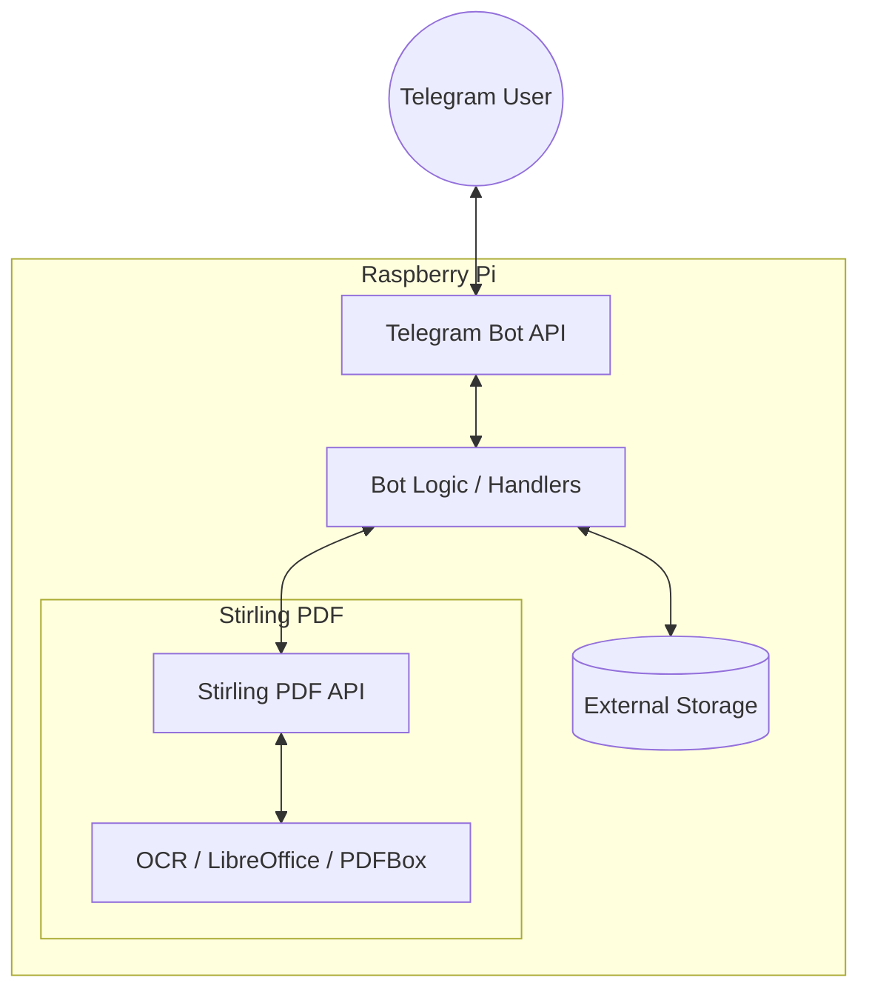

# System Architecture

The Stirling PDF Assistant runs in a Docker setup alongside a local Telegram Bot API server and Stirling PDF. Below is a high-level view of how the components interact.

## Diagram

## Components

### 1. Telegram Bot (Frontend)

The user-facing interface. Uses `python-telegram-bot`'s `Application` and `Handler` patterns. Session state is kept in `chat_data` for multi-step operations like merging.

### 2. Stirling PDF Client (Middleware)

Bridges bot logic with the Stirling PDF API. `StirlingPDFClient` in `client.py` handles multipart uploads. Each API endpoint is represented by a class inheriting from `BaseTool`.

### 3. Stirling PDF (Backend)

The service that processes the actual PDF transformations. Runs separately (usually in Docker) and exposes a REST API.

### 4. Storage and Persistence

- Temporary files and user data are stored on disk.
- Configuration is handled via `.env` files.

## Document Processing Flow

1. User sends a document to the bot.
2. Bot checks authorization and file size.
3. Bot shows available actions (inline buttons).
4. User picks an action.
5. Bot downloads the file into memory.
6. Bot passes the file to `StirlingPDFClient`.
7. Client sends a multipart POST to the Stirling PDF API.
8. Stirling PDF processes the file and returns the result.
9. Bot sends the result back to the user.
