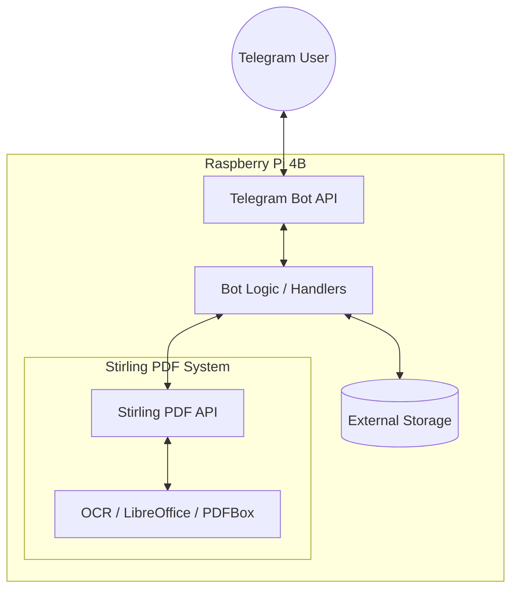

# System Architecture

The Stirling PDF Assistant is designed to run in a resource-constrained environment, such as a Raspberry Pi, providing a private and powerful PDF toolset.

## High-Level Overview

## Component Breakdown

### 1. Telegram Bot (Frontend)
- **Role**: Interface for the user.
- **Implementation**: Uses `python-telegram-bot`'s `Application` and `Handler` patterns.
- **Session Management**: Uses `chat_data` to maintain state during multi-step operations (like merging).

### 2. Stirling PDF Client (Middleware)
- **Role**: Bridges the bot logic with the Stirling PDF API.
- **Implementation**: `StirlingPDFClient` in `client.py`.
- **Modularity**: Uses a "Tool" pattern where each API endpoint is represented by a class inheriting from `BaseTool`.

### 3. Stirling PDF (Backend)
- **Role**: The heavy lifter that performs the actual PDF transformations.
- **Implementation**: A separate service (usually in Docker) that exposes a REST API.

### 4. Storage & Persistence
- **Disk**: Used for temporary file storage and user list persistence.
- **Environment**: Configuration is handled via `.env` files.

## Data Flow: Document Processing

1. User sends a document to the Telegram Bot.
2. Bot validates user authorization and file size.
3. Bot presents a menu of available actions (Inline Buttons).
4. User selects an action (e.g., "OCR").
5. Bot downloads the file from Telegram servers into memory (as `bytes`).
6. Bot passes the file to the `StirlingPDFClient`.
7. Client executes the corresponding `Tool`, sending a `multipart/form-data` POST request to Stirling PDF.
8. Stirling PDF processes the file and returns the result as a binary stream.
9. Bot sends the resulting file back to the user via Telegram.
