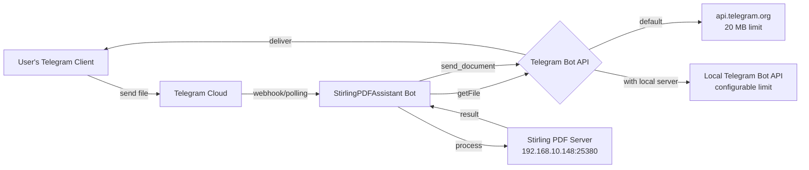

# Feature: Local Telegram Bot API Server Support

## Problem Statement

Telegram's public Bot API enforces a **20 MB file download limit**. The StirlingPDFAssistant bot downloads every user-uploaded file from Telegram servers into memory before processing, so any file larger than 20 MB fails with `400: file is too big`.

The user already hosts a Stirling PDF server locally and wants to allow files up to 50 MB. The solution is to connect the bot to a **self-hosted Telegram Bot API server**, which removes the 20 MB download limit and allows configuration for larger file sizes.

## Requirements

- [x] REQ-1: Add a `TELEGRAM_BOT_API_URL` environment variable so users can point the bot at a local Telegram Bot API server
- [x] REQ-2: When `TELEGRAM_BOT_API_URL` is set, pass it to `ApplicationBuilder.base_url()` so all Telegram API calls (including file downloads) go through the local server
- [x] REQ-3: When `TELEGRAM_BOT_API_URL` is **not** set, keep the default behavior (use `https://api.telegram.org`) — zero-config backward compatibility
- [x] REQ-4: Add a `telegram-bot-api` service to `docker-compose.yml` so users can deploy everything with one `docker compose up` (now enabled by default)
- [x] REQ-5: Update `.env.example` with the new variable and clear documentation
- [x] REQ-6: Ensure the `send_document` upload path also uses the custom base URL (it already will, since it uses the same `context.bot`)
- [x] REQ-7: Fix UID mismatch between the default Bot API image (UID 101) and the bot container (UID 1000) — solved via a custom `docker/telegram-bot-api/Dockerfile` that patches `/etc/passwd` and `/etc/group`
- [x] REQ-8: Build and publish a multi-arch custom Bot API image to GHCR for RPi deployment with `docker compose pull`

## Architecture

### Current flow (no local API server)

```
User sends file (up to 50 MB upload)
  →
Bot receives file_id
  →
Bot calls api.telegram.org/bot<token>/getFile  ← 20 MB limit here
  →
Bot downloads from api.telegram.org/file/bot<token>/<file_path>
  →
Bot sends file to local Stirling PDF server
```

### New flow (with local Bot API server)

```
User sends file (up to 50 MB upload)
  →
Bot receives file_id
  →
Bot calls localhost:8081/bot<token>/getFile  ← no 20 MB limit
  →
Bot downloads from localhost:8081/file/bot<token>/<file_path>
  →
Bot sends file to local Stirling PDF server
```

### Component diagram



### What changes in each file

| File | Change |
|------|--------|
| `.env.example` | Add `TELEGRAM_BOT_API_URL` with comment |
| `src/.../main.py` | Read `TELEGRAM_BOT_API_URL` env var; pass to `ApplicationBuilder.base_url()` |
| `docker-compose.yml` | Add optional `telegram-bot-api` service |
| `README.md` | Document the new env var and how to run with local Bot API |

## API / Interface

### New environment variable

```bash
# Optional: Self-hosted Telegram Bot API server URL
# Leave unset to use the default api.telegram.org (20 MB download limit)
# Set to your local Bot API server to support larger file downloads
# Example: http://telegram-bot-api:8081
TELEGRAM_BOT_API_URL=""
```

### ApplicationBuilder change (main.py)

```python
# Current
application = ApplicationBuilder().token(token).post_init(post_init).build()

# New
bot_api_url = os.getenv("TELEGRAM_BOT_API_URL", "")
if bot_api_url:
    # Ensure the URL ends with a trailing slash for PTB's urljoin
    bot_api_url = bot_api_url.rstrip("/") + "/"
    application = (
        ApplicationBuilder()
        .token(token)
        .base_url(bot_api_url)
        .post_init(post_init)
        .build()
    )
else:
    application = ApplicationBuilder().token(token).post_init(post_init).build()
```

### docker-compose.yml (current state)

```yaml
services:
  telegram-bot-api:
    build: ./docker/telegram-bot-api
    image: ghcr.io/audeldiaz/StirlingPDFAssistant/telegram-bot-api:master
    container_name: telegram-bot-api
    restart: unless-stopped
    env_file: .env
    environment:
      - TELEGRAM_LOCAL=true
    volumes:
      - telegram-bot-api-data:/var/lib/telegram-bot-api
    # No ports exposed — access is internal via Docker DNS (telegram-bot-api:8081)

  stirlingpdfassistant:
    build: .
    image: ghcr.io/audeldiaz/StirlingPDFAssistant:master
    container_name: stirlingpdfassistant
    restart: unless-stopped
    depends_on:
      - telegram-bot-api
    volumes:
      - ./users.json:/app/users.json
      - telegram-bot-api-data:/var/lib/telegram-bot-api:ro

volumes:
  telegram-bot-api-data:
```

Key differences from the original spec:
- Uses a custom `Dockerfile` instead of `aiogram/telegram-bot-api:latest` — needed to match UID 1000 for shared volume access.
- Both `build` and `image` are specified for dual dev/prod workflow: `docker compose up --build` for local dev, `docker compose pull && docker compose up` for RPi deployment (pulls pre-built multi-arch from GHCR).
- No ports exposed on the Bot API server — communication is via Docker's internal DNS.
- `telegram-bot-api` service is enabled by default (not optional) since it's required for >20 MB file support.
- Shared volume `telegram-bot-api-data` is mounted read-only (`:ro`) in the bot container.

### Custom UID Dockerfile

The default `aiogram/telegram-bot-api` image runs as UID 101, but the bot container uses UID 1000. Files created by the Bot API server on the shared volume are owned by 101, causing "Permission denied" errors when the bot tries to read them.

The custom `docker/telegram-bot-api/Dockerfile` patches the UID/GID:

```dockerfile
RUN sed -i 's/^telegram-bot-api:[^:]*:[^:]*:[^:]*/telegram-bot-api:x:1000:1000/' /etc/passwd \
 && sed -i 's/^telegram-bot-api:x:101:/telegram-bot-api:x:1000:/' /etc/group \
 && chown -R 1000:1000 /var/lib/telegram-bot-api
```

## Testing Strategy

- **Unit test**: Verify that `main.py` passes the correct `base_url` to `ApplicationBuilder` when `TELEGRAM_BOT_API_URL` is set
- **Unit test**: Verify that default behavior (no env var) still works
- **Manual test**: Run with a local Bot API server and verify >20 MB file compress works

## Out of Scope

- Configuring the Telegram Bot API server itself (API_ID, API_HASH from my.telegram.org) — that's user-side setup
- HTTPS/TLS for the local Bot API server
- Migration of existing docker volumes or data
- Support for multiple Bot API endpoints (only one base URL)
