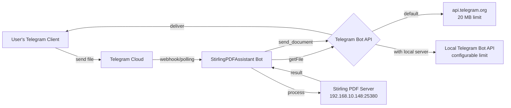

# Feature: Local Telegram Bot API Server Support

## Problem Statement

Telegram's public Bot API enforces a **20 MB file download limit**. The StirlingPDFAssistant bot downloads every user-uploaded file from Telegram servers into memory before processing, so any file larger than 20 MB fails with `400: file is too big`.

The user already hosts a Stirling PDF server locally and wants to allow files up to 50 MB. The solution is to connect the bot to a **self-hosted Telegram Bot API server**, which removes the 20 MB download limit and allows configuration for larger file sizes.

## Requirements

- [ ] REQ-1: Add a `TELEGRAM_BOT_API_URL` environment variable so users can point the bot at a local Telegram Bot API server
- [ ] REQ-2: When `TELEGRAM_BOT_API_URL` is set, pass it to `ApplicationBuilder.base_url()` so all Telegram API calls (including file downloads) go through the local server
- [ ] REQ-3: When `TELEGRAM_BOT_API_URL` is **not** set, keep the default behavior (use `https://api.telegram.org`) — zero-config backward compatibility
- [ ] REQ-4: Add an optional `telegram-bot-api` service to `docker-compose.yml` so users can deploy everything with one `docker compose up`
- [ ] REQ-5: Update `.env.example` with the new variable and clear documentation
- [ ] REQ-6: Ensure the `send_document` upload path also uses the custom base URL (it already will, since it uses the same `context.bot`)

## Architecture

### Current flow (no local API server)

```
User sends file (up to 50 MB upload)
  →
Bot receives file_id
  →
Bot calls api.telegram.org/bot<token>/getFile  ← 20 MB limit here
  →
Bot downloads from api.telegram.org/file/bot<token>/<file_path>
  →
Bot sends file to local Stirling PDF server
```

### New flow (with local Bot API server)

```
User sends file (up to 50 MB upload)
  →
Bot receives file_id
  →
Bot calls localhost:8081/bot<token>/getFile  ← no 20 MB limit
  →
Bot downloads from localhost:8081/file/bot<token>/<file_path>
  →
Bot sends file to local Stirling PDF server
```

### Component diagram



### What changes in each file

| File | Change |
|------|--------|
| `.env.example` | Add `TELEGRAM_BOT_API_URL` with comment |
| `src/.../main.py` | Read `TELEGRAM_BOT_API_URL` env var; pass to `ApplicationBuilder.base_url()` |
| `docker-compose.yml` | Add optional `telegram-bot-api` service |
| `README.md` | Document the new env var and how to run with local Bot API |

## API / Interface

### New environment variable

```bash
# Optional: Self-hosted Telegram Bot API server URL
# Leave unset to use the default api.telegram.org (20 MB download limit)
# Set to your local Bot API server to support larger file downloads
# Example: http://telegram-bot-api:8081
TELEGRAM_BOT_API_URL=""
```

### ApplicationBuilder change (main.py)

```python
# Current
application = ApplicationBuilder().token(token).post_init(post_init).build()

# New
bot_api_url = os.getenv("TELEGRAM_BOT_API_URL", "")
if bot_api_url:
    # Ensure the URL ends with a trailing slash for PTB's urljoin
    bot_api_url = bot_api_url.rstrip("/") + "/"
    application = (
        ApplicationBuilder()
        .token(token)
        .base_url(bot_api_url)
        .post_init(post_init)
        .build()
    )
else:
    application = ApplicationBuilder().token(token).post_init(post_init).build()
```

### docker-compose.yml addition

```yaml
services:
  telegram-bot-api:
    image: aiogram/telegram-bot-api:latest
    container_name: telegram-bot-api
    restart: unless-stopped
    environment:
      TELEGRAM_API_ID: "${TELEGRAM_API_ID}"
      TELEGRAM_API_HASH: "${TELEGRAM_API_HASH}"
      # Optional: increase max file size from default
      # MAX_FILE_SIZE: 52428800  # 50 MB
    volumes:
      - telegram-bot-api-data:/var/lib/telegram-bot-api
    ports:
      - "8081:8081"

  stirlingpdfassistant:
    # ... existing config, plus:
    environment:
      - TELEGRAM_BOT_API_URL=http://telegram-bot-api:8081
    depends_on:
      - telegram-bot-api

volumes:
  telegram-bot-api-data:
```

## Testing Strategy

- **Unit test**: Verify that `main.py` passes the correct `base_url` to `ApplicationBuilder` when `TELEGRAM_BOT_API_URL` is set
- **Unit test**: Verify that default behavior (no env var) still works
- **Manual test**: Run with a local Bot API server and verify >20 MB file compress works

## Out of Scope

- Configuring the Telegram Bot API server itself (API_ID, API_HASH from my.telegram.org) — that's user-side setup
- HTTPS/TLS for the local Bot API server
- Migration of existing docker volumes or data
- Support for multiple Bot API endpoints (only one base URL)
